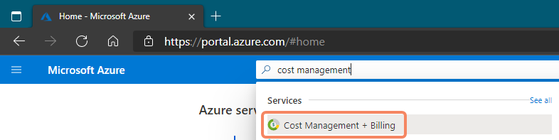
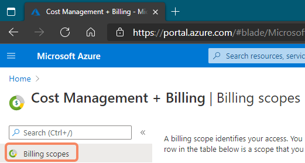
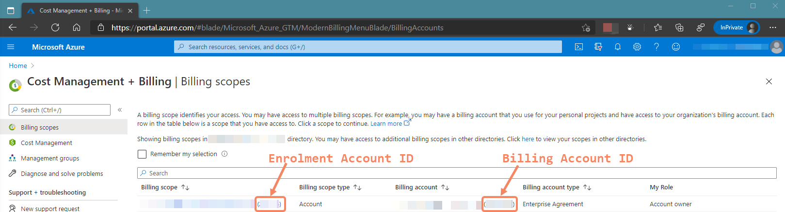
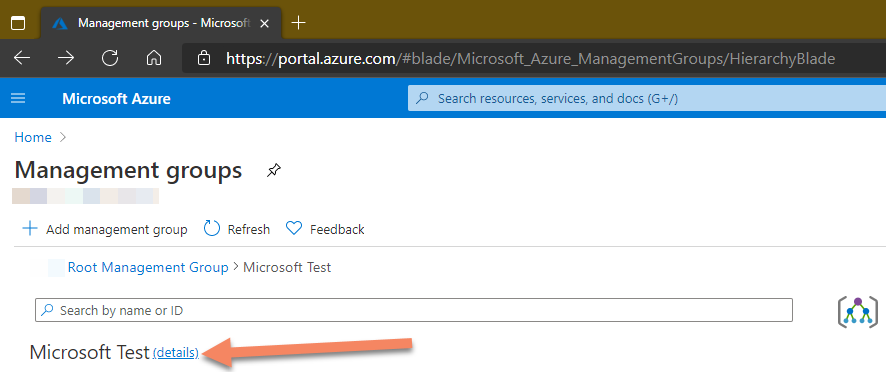
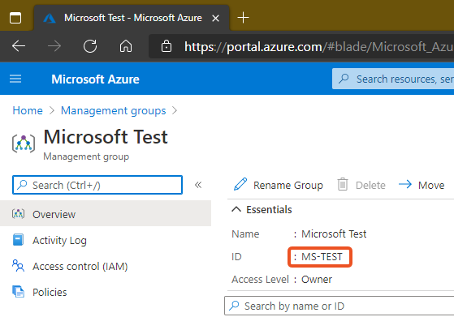
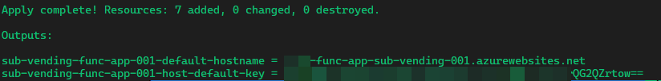
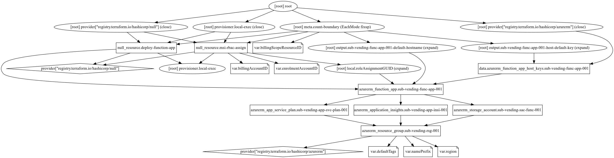

# Azure Subscription Vending Function - Azure Function (PowerShell Core)

This project holds everything you need to deploy and create an Azure Function, based on PowerShell Core, to assist in provisioning Azure EA (Enterprise Agreement) Subscriptions programmatically in an API style. This was born from working with customers primarily creating Enterprise Scale Landing Zones with Terraform as there is no resource for creating subscriptions within the Terraform AzureRM provider at this time.

> There is an open GitHub issue on the Terraform AzureRM provider repository to enable subscription creation via Terraform. [Issue Number 1216](https://github.com/terraform-providers/terraform-provider-azurerm/issues/1216)

> This only works for EA (Enterprise Agreement) Customers at this time. However the code could be amended for other supported subscription types like MCA or MPA. Please create a PR on this repo if you do use and amend this code :+1:

Thanks to [@matt-FFFFFF](https://github.com/matt-FFFFFF) for his contributions and assistance with this project!

## Changelog

| Version | Date | Notes |
| :-----: | :--: | :---: |
| V1.0.1  | 24/12/2020 | Added missing double quotes to functions JSON response. |
| V2 | 29/12/2020 | Migrated to Subscription Alias REST PUT API deployment via `Invoke-AzRestMethod` command from PowerShell Modules, to enable Management Group support & Azure Policy Benefits |
| V2.1 | 30/12/2020 | Added support to provide your own Subscription Alias **(Optional)**. If not provided the function will randomly create a GUID with `New-Guid` |

## Roadmap

Here is what I have planned for this Azure Function. Please feel free to raise/create an issue against this repository for feature requests or feel free to contribute via a PR yourself :+1:

| Item | Description | ETA |
| :-- | :--------- | :-: |
| ~~Management Group Support~~ | ~~This involves a change from using the PowerShell Az.Subscription module to create the subscription to using ARM/REST APIs to create the subscription.~~ | Completed and released in V2 - Dec 2020 :heavy_check_mark: |

## Components

This repository contains the below components:

| Component | Description | Path |
| :---------: | :-----------: | :----: |
| Terraform | IaC code used to deploy the required infrastructure to support the Azure Function. It also applies RBAC and deploys the Azure Function app from a the ZIP archive. | [terraform/](https://github.com/jtracey93/AzureSubscriptionVendingFunction/tree/master/terraform) |
| Azure Function Source Code | The source code for the Azure Function (PowerShell Core). The ZIP archive is built from these files | [CreateSubs/](https://github.com/jtracey93/AzureSubscriptionVendingFunction/tree/master/CreateSubs) & the following files in the [root of the repository](https://github.com/jtracey93/AzureSubscriptionVendingFunction): '***.funcignore***', '***host.json***', '***profile.ps1***', '***proxies.json***' & '***requirements.psd1***'|
| Azure Function ZIP Archive | The ready to deploy ZIP archive of the Azure Function Source Code files as detailed above. This is used by Terraform local-exec. | [zipdeploy/](https://github.com/jtracey93/AzureSubscriptionVendingFunction/tree/master/zipdeploy) |

## Pre-Requisites 

### Software/Packages

The below packages are required to be installed on the machine you will run this from, before trying to deploy this function:

1. [PowerShell Core](https://docs.microsoft.com/en-us/powershell/scripting/install/installing-powershell?view=powershell-7.1#powershell)
2. [Azure CLI](https://docs.microsoft.com/en-us/cli/azure/install-azure-cli)
3. [Terraform](https://www.terraform.io/downloads.html)
4. [Git](https://git-scm.com/downloads)

If you are a [Chocolatey](https://chocolatey.org/) user then you can run the below commands to install these pre-requisites:

```
choco install powershell-core -y
choco install azure-cli -y
choco install terraform -y
choco install git -y
```

### Others

The other pre-requisites are as follows:

1. An Azure User account, **must be the same account**, that has access to the following:
   1. An Active Azure Subscription with the [Contributor RBAC role assigned](https://docs.microsoft.com/en-gb/azure/role-based-access-control/role-assignments-portal#add-a-role-assignment)
       - This Subscription will be used to deploy the Azure Function into.
   2. An [Enterprise Agreement (EA) Account](https://docs.microsoft.com/en-gb/azure/cost-management-billing/manage/ea-portal-administration#add-an-account) 
      - This will be the account that is used to deploy all the Subscriptions under on the EA by the Azure Function.
      - This EA account should also have permissions to create EA Dev/Test Subscriptions. This can be done by following the process documented at: [Azure EA portal administration](https://docs.microsoft.com/en-gb/azure/cost-management-billing/manage/ea-portal-administration#enterprise-devtest-offer)
   3. ***(Optional)*** RBAC permissions on the Management Group you wish to grant the Azure Function the [Management Group Contributor](https://docs.microsoft.com/en-us/azure/role-based-access-control/built-in-roles#management-group-contributor) RBAC role to so it can create and assign subscriptions to the desired Management Groups in your API request (RBAC inheritance will apply as normal so the Azure Function will be able to assign subscription to any Management Group either at or below the Management Group you specify at deployment time of this Azure Function). Further info on Management Group RBAC can be found [here.](https://docs.microsoft.com/en-us/azure/governance/management-groups/overview#moving-management-groups-and-subscriptions)
2. The Enrolment Account ID & Billing Account ID - See the [below section](#getting-ea-and-billing-ids) for details on how to get these
3. ***(Optional)*** The Management Group Name (ID) of the Management Group you wish the Azure Function to have the [Management Group Contributor](https://docs.microsoft.com/en-us/azure/role-based-access-control/built-in-roles#management-group-contributor) RBAC role assigned at (remember inheritance will apply as per normal so best to make this assignment as high as possible beneath the Tenant Root Group) - For further information on finding this please see the [below section](#optional-finding-the-management-group-name-id)
4. ***(Optional)*** Delete the comments in the Terraform files to enable the Management Group support - please follow the instructions in the [below section.](#optional-remove-comments-from-terraform-files-for-management-group-rbac)
5. Login on the same local machine to the Azure CLI with the command: `az login`
   - To avoid SSO signing you in to the incorrect user account, open an InPrivate browser window and login to the [Azure Portal](https://portal.azure.com) as the required user account and then run `az login --use-device-code` to sign in as the correct user.
6. [Clone](https://docs.github.com/en/free-pro-team@latest/github/creating-cloning-and-archiving-repositories/cloning-a-repository) this git repo to the local machine where you wish to run this deployment from.

### Getting EA and Billing IDs

As you have seen from the second pre-requisite above, the EA Account ID & Billing Account ID are required to be passed in as inputs to terraform variables (either at runtime or by adding default values to the corresponding variables in the 'variables.tf' file.). To find these two ID's follow the below instructions:

1. Open an InPrivate browser window. (To avoid any SSO issues)
2. Login to the [Azure Portal](https://portal.azure.com) as the user account that meets the first pre-requisite requirement from above. (EA Account Owner, Access to Azure Subscription to deploy function too & Management Group Owner/Contributor at the required hierarchy)
3. Search for 'cost management' and open the 'Cost Management + Billing' blade:



4. You should be taken to the 'Billing scopes' blade within the 'Cost Management + Billing' blade, if not please select the 'Billing scopes' blade:



5. The Enrolment Account ID & Billing Account ID are shown on the 'Billing scopes' blade in the brackets "(xxx)" as shown in the screenshot below:
   - *The Enrolment Account ID is 6 digits & the Billing Account ID is 8 digits*



> Further information on this can be found in the Enterprise Scale documentation at [Enable Service Principal to create landing zones
](https://github.com/Azure/Enterprise-Scale/blob/main/docs/Deploy/enable-subscription-creation.md).
> The Enterprise Scale docs also walk through finding the above required IDs via PowerShell with the AZ module and also applying the RBAC permissions. However the RBAC assignment is handled by terraform in this repository, when the 2 required IDs are passed to it.

### ***(Optional)*** Finding the Management Group Name (ID)

To find the Management Group Name (ID) for where you wish to allow the Azure Function to be assigned the RBAC role of [Management Group Contributor](https://docs.microsoft.com/en-us/azure/role-based-access-control/built-in-roles#management-group-contributor), please do the following:

1. Open an InPrivate browser window. (To avoid any SSO issues)
2. Login to the [Azure Portal](https://portal.azure.com) as the user account that meets the first pre-requisite requirement from above. (EA Account Owner, Access to Azure Subscription to deploy function too & Management Group Owner/Contributor at the required hierarchy)
3. Browse to the Management Group blade and navigate the hierarchy to the desired Management Group:



4. Click on the 'details' button, as shown above
5. On the new blade that loads, make a note of the 'ID' value (as shown highlighted below); as this is what will be required to enter as a Terraform variable later on:



### ***(Optional)*** Remove comments from Terraform files for Management Group RBAC

If you wish to enable the Azure Function to create Subscriptions and assign to the desired Management Group you will need to delete the comments in the below files, once you have cloned the Git repository locally to your machine. The files to remove the comments from are below along with the line numbers to completely remove from each file to remove the comments:

| File Name | Location | Line Numbers To Remove | 
| --------- | -------- | ---------------------- |
| `main.tf` | terraform/main.tf | Lines 78 & 88 |
| `variables.tf` | terraform/variables.tf | Lines 31 & 36 |

> Please remember to save the files once you have removed the comment lines before trying to continue!

## Deployment Instructions

1. Complete [pre-requisites](#pre-requisites)
2. Open an InPrivate browser window. (To avoid any SSO issues)
3. Login to the [Azure Portal](https://portal.azure.com) as the user account that meets the first pre-requisite requirement from above. (EA Account Owner & Access to Azure Subscription to deploy function too &  ***(Optional)*** Management Group Owner/Contributor at the required hierarchy)
4. Open your CLI of choice (PowerShell Core, PowerShell, CMD, WSL, etc.)
5. Login to the Azure CLI in the CLI window with the `az login --use-device-code` and following it's instructions whilst using the InPrivate browser window as per steps 2 & 3 above
6. Change directory to the folder you cloned this git repository to as per the [pre-requisites](#pre-requisites) in the CLI window
7. Change directory to the `terraform` folder within the cloned repository folder in the CLI window
8. Run `terraform init`
9. Run `terraform apply`, 
   - You will need to enter the Enrolment Account ID & Billing Account ID (And potentially the Management Group Name (ID), if you chose to enable this as above) gathered during the [pre-requisites](#pre-requisites) when prompted to by Terraform
   - As well as a name prefix (keep this short (2/4 characters) and only alphanumeric characters) 
   - And an Azure region to deploy too (all lowercase and one word - e.g. `northeurope`)
   - Finally then approve Terraform to deploy to Azure with by entering `yes` when prompted too.
10. Wait for Terraform to do its thing and complete, showing something similar to the below screenshot:



## Azure Subscription Alias - Explained

> You do not have to provide an 'Alias' if you do not wish to, the Azure function will generate a random GUID automatically for you if you do not provide it in the API request body as detailed below and then return it to you as part of the API response.

Before using the Azure Function that you have just deployed, it is important to understand what the term "Alias" in this context actually means; this will help you make a decision on how to decide what to use as your "Alias" as part of the API request.

Here are some key points of information regarding the "Alias":

- Alias must be unique within the Azure AD tenant
- Alias ID is not the same as the Subscription ID
  - The Subscription ID is automatically generated by the Azure platform at time of creation
  - The Alias is only a pointer to the Subscription 
- Deleting an Alias **does not** delete the associated Subscription
- RBAC applied to the Alias **does not** apply to the associated Subscription, they are completely separate & different resources as far as RBAC is concerned.

[Azure Enterprise Scale guidance](https://github.com/Azure/Enterprise-Scale/tree/main/examples/landing-zones/empty-subscription#parameters) suggests to use the Subscription Display Name as the Alias, however if there is not a consistent and/or followed Subscription naming scheme, this may be a potential issue in terms of uniqueness. Therefore if the Azure Function receives no Alias in the request body it will generate a random GUID for you at runtime and return it as part of the response once the Subscription creation is successful.

## Using The Azure Function

The Azure Function is accessed via the URL provided as part of the output from Terraform. It is open to requests from anywhere and has no IP restrictions in place (you can add these if you wish to the Terraform resources). However it is protected by an Azure Function Authorisation Key which must be provided as part of the URL, this is also provided as an output from Terraform upon it's completion as shown in the above in the above screenshot.

The URL should look like this once constructed from the Terraform outputs: `https://<REPLACE WITH VALUE OF sub-vending-func-app-001-default-hostname OUTPUT>.azurewebsites.net/api/CreateSubs?code<REPLACE WITH VALUE OF sub-vending-func-app-001-host-default-key OUTPUT>`

> You may decide to store the Azure Function Key in something like Azure Key Vault, however that is left for you to decide and adopt based on how you plan to integrate with this Azure Function.

The Azure Function takes a simple JSON object (all entities are required) via an HTTP POST to the URL, as shown in the examples below:

### Without Management Group Assignment

```json
{
    "subscriptionAlias": "YOUR-UNIQUE-PROVIDED-ALIAS",
    "subscriptionDisplayName": "sub-name-001",
    "subscriptionBillingScope": "/providers/Microsoft.Billing/billingAccounts/XXXXXXXX/enrollmentAccounts/XXXXXX",
    "subscriptionOfferType": "Production"
}
```

> Please change these values to match your requirements. The `subscriptionBillingScope` should use the values gathered in the pre-requisites.

> The `subscriptionAlias` property is not required in the request body as [detailed above](#azure-subscription-alias---explained) 

> The `subscriptionOfferType` accepts only either `Production` or `DevTest`

After a period of time, depending on if the Azure Function has had to cold start or not (as it uses the Consumption tier/SKU), you will receive a JSON response as shown in the below example:

```json
{
    "subscriptionAlias": "YOUR-UNIQUE-PROVIDED-ALIAS",
    "subscriptionDisplayName": "sub-name-001",
    "subscriptionID": "xxxxxxxx-xxxx-xxxx-xxxx-xxxxxxxxxxxx",
    "subscriptionBillingScope": "/providers/Microsoft.Billing/billingAccounts/XXXXXXXX/enrollmentAccounts/XXXXXX",
    "subscriptionOfferType": "Production",
    "subscriptionManagementGroupID": ""
}
```

> As you are not specifying a Management Group as part of the Subscription creation request, it will be placed in the default Management Group (normally the Tenant Root Group, unless this has been changed as documented [here](https://docs.microsoft.com/en-us/azure/governance/management-groups/how-to/protect-resource-hierarchy#setting---default-management-group)). You can move it as you wish once the Subscription has been created.

### With Management Group Assignment

```json
{
    "subscriptionAlias": "YOUR-UNIQUE-PROVIDED-ALIAS",
    "subscriptionDisplayName": "sub-name-001",
    "subscriptionBillingScope": "/providers/Microsoft.Billing/billingAccounts/XXXXXXXX/enrollmentAccounts/XXXXXX",
    "subscriptionOfferType": "Production",
    "subscriptionManagementGroupId": "/providers/Microsoft.Management/managementGroups/XXXXXXXX"
}
```

> Please change these values to match your requirements. The `subscriptionBillingScope` should use the values gathered in the pre-requisites.

> The `subscriptionAlias` property is not required in the request body as [detailed above](#azure-subscription-alias---explained) 

> The `subscriptionOfferType` accepts only either `Production` or `DevTest`

After a period of time, depending on if the Azure Function has had to cold start or not (as it uses the Consumption tier/SKU), you will receive a JSON response as shown in the below example:

```json
{
    "subscriptionAlias": "YOUR-UNIQUE-PROVIDED-ALIAS",
    "subscriptionDisplayName": "sub-name-001",
    "subscriptionID": "xxxxxxxx-xxxx-xxxx-xxxx-xxxxxxxxxxxx",
    "subscriptionBillingScope": "/providers/Microsoft.Billing/billingAccounts/XXXXXXXX/enrollmentAccounts/XXXXXX",
    "subscriptionOfferType": "Production",
    "subscriptionManagementGroupId": "/providers/Microsoft.Management/managementGroups/XXXXXXXX"
}
```

Happy Subscription Creating :+1:

## Terraform Resource Graph Diagram

In case you want to see what Terraform is doing and creating, checkout the below diagram. Or review the HCL in the [terraform/](https://github.com/jtracey93/AzureSubscriptionVendingFunction/tree/master/terraform) directory.


